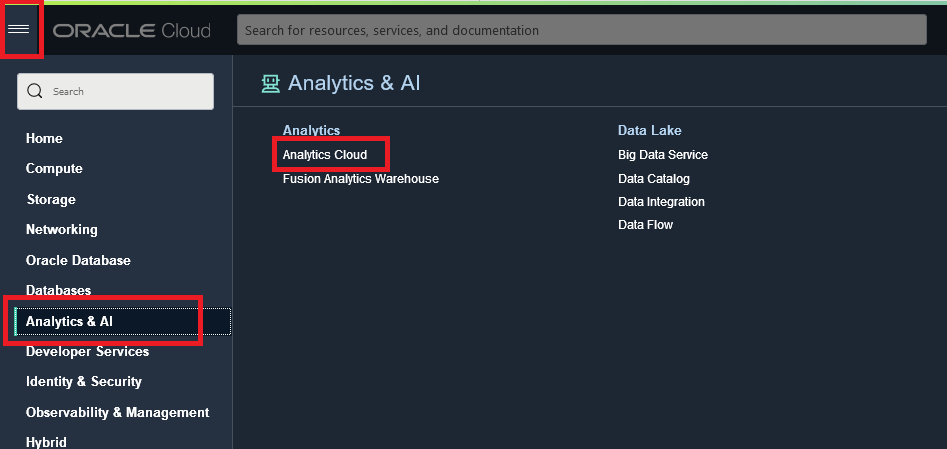
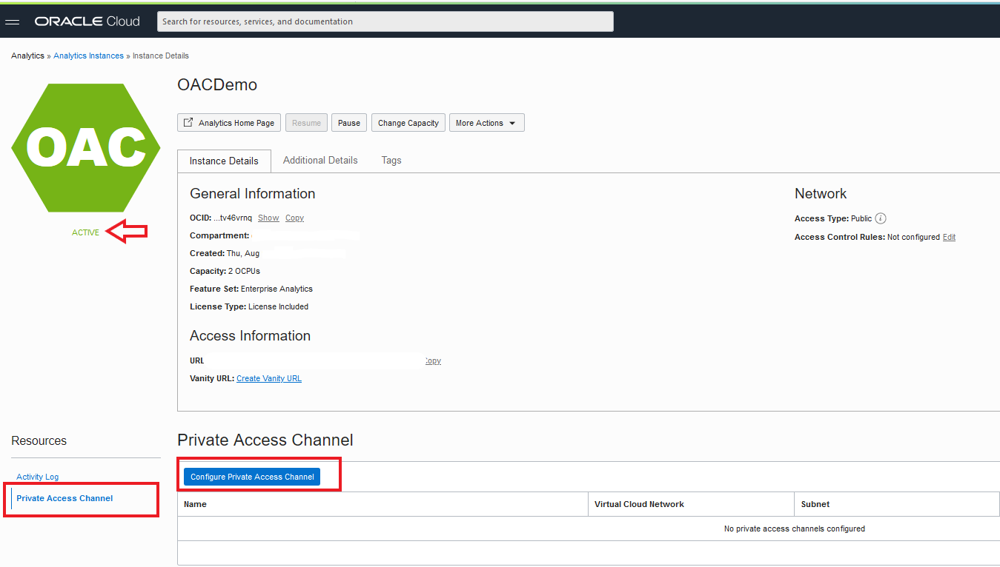
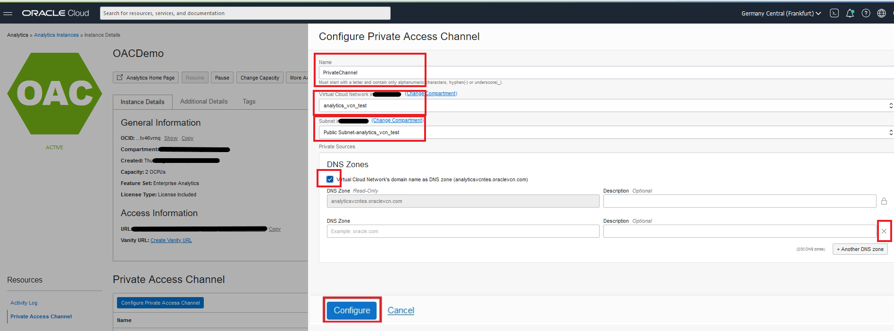

# Create MySQL DB Service (MDS) with HeatWave 

## Introduction

In this lab we will enable the HeatWave cluster and configure a private access channel for the Oracle Analytics instance.
The DB System and HeatWave cluster must use the same shape, the shape defines the number of CPU cores, the amount of RAM, and so on. The size of the HeatWave cluster needed depends on tables and columns required to load, and the compression achieved in memory for this data.
By enabling HeatWave you will deploy a standalone DB System characterized by a HeatWave-compatible shape (MySQL.HeatWave.VM.Standard.E3) and 1TB of data storage that will accelerate processing of analytic queries. For more information, check **[HeatWave Documentation](https://docs.oracle.com/en-us/iaas/mysql-database/doc/heatwave1.html#GUID-9401C69A-B379-48EB-B96C-56462C23E4FD)**. 

Estimated Lab Time: 15 minutes.

### Objectives

-  Add HeatWave Cluster to MySQL Database Service
-  Configure Private Access Channel - OAC

### Prerequisites

  - All previous labs have been successfully completed.

## **Task 1:** Add HeatWave Cluster to MySQL Database Service

1. We will need to wait for the DB System which you have just created until its status turns  **Active**, it would takes around 10 minutes.

### **Task 1.1:**
- We will need to wait for the DB System which you have just created until its status turns  _**Active**_, it would takes around 10 minutes.

 Once it is active you can take note of the _**Private IP Address**_ of the MySQL DB System which we will use later in the workshop.

    

### **Task 1.2:**
- From the menu on the left bottom side select _**HeatWave**_, and click on the button _**Add HeatWave Cluster**_ located on the right.
  
    

  Check that Shape looks as per picture below and that Node Count is set to 2, and then click the button **Add HeatWave Cluster**.

    

### **Task 1.3:**
- You will be brought back to the main page where you can check for the creation status. After some seconds you should see the nodes in _**Creating**_ status.
  
    

  After completion, the node status will switch to **Active** status. The process will take some time to be completed. 

## **Task 2:** Configure Private Access Channel - OAC

### **Task 2.1:**

- Back to the Analytics Cloud from _**hamburger menu**_ in the upper left corner and click on _**Analytics & AI -> Analytics Cloud**_ by now the status of the instance should have changed to _Active_. 

- Click on the button _**Configure Private Access Channel**_ under the Private Access Channel section to create a private access to the MySQL Database Service Instance.

### **Task 2.2:**
- In the next window you first need to fill the name for the channel **PrivateChannel**. Then, choose the VCN created earlier **`analytics_vcn_test`**, and make sure you select the correct subnet, **`Public Subnet-analytics_vcn_test`**, otherwise you won't be able to connect!
Check _**Virtual Cloud Network's domain name as DNS zone**_, and remove the additional _**DNS Zone**_, using the X icon on the right side of the DNS Zone section, and finally click _**Configure**_.  

_**Note:**_ It will take up to _**50 minutes**_ to create the private channel so go ahead and proceed to the next Lab! 

As a recap, in this lab we have enabled HeatWave cluster to MySQL Database Service, and configured Private Access Channel for the Oracle Analytics Cloud instance created in Lab 1. 
 
Well done, you can now proceed to the next lab!

## Acknowledgements
- **Author** - Rawan Aboukoura - Technology Product Strategy Manager, Vittorio Cioe - MySQL Solution Engineer
- **Contributors** - Priscila Iruela - Technology Product Strategy Director, Victor Martin - Technology Product Strategy Manager 
- **Last Updated By/Date** -
