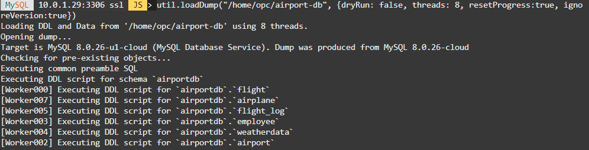
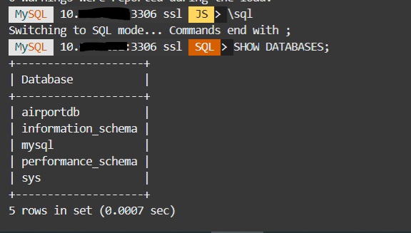

# Run queries leveraging HeatWave
 
   
## Introduction

HeatWave accelerates MySQL queries by 400X using massively parallel processing to provide real-time analytics. So in this lab we will run queries with HeatWave enabled and without and finally observe the results.

Estimated Time: 20 minutes

### Objectives
-  Import data into MySQL Database Service and load tables to HeatWave
- Execute queries leveraging HeatWave and compare the query execution time with and without HeatWave enabled

### Prerequisites

  - All previous labs have been successfully completed.

  
  
## **Task 1:** Import data into MySQL Database Service and load tables to HeatWave

### **Task 1.1:**

- Back to the ssh connection at the cloud shell, if it is disconnected, type the following command to connect again to the instance using the publec IP address of the compute instance.


```
<copy>ssh -i <private-key-file-name>.key opc@<compute_instance_public_ip></copy>
```


- Unpack the airport database sample downloaded in Lab1-Task3.7:
```
<copy>unzip airport-db.zip</copy>
```  


- After it is done extracting the files, verify the extracted material executing the following command:
```
<copy>ls /home/opc/airport-db</copy>
```

Among the output, you should see the following file names:


- Connect to MySQL DB System with MySQL Shell using MySQL DB private IP address, as the following command:
```
<copy>mysqlsh --user=admin --password=Oracle.123 --host=<mysql_private_ip_address> --port=3306 --js</copy>
```


### **Task 1.2:**

- From the MySQL Shell connection, import the data set into MySQL DB System.
This command will commit a dry run of the import.

```
<copy>util.loadDump("/home/opc/airport-db", {dryRun: true, resetProgress:true, ignoreVersion:true})</copy>
```


 If it terminates without errors, execute the following to load the dump for real:
```
<copy> util.loadDump("/home/opc/airport-db", {dryRun: false, threads: 8, resetProgress:true, ignoreVersion:true})</copy>
```
_Note:_ It takes around 5 minutes to finish.


### **Task 1.3:**
- Check the imported data. From MySQL Shell execute the commands:

```
<copy>
\sql
</copy>
```

```
<copy>
SHOW DATABASES;
</copy>
```
You should see the following output:



Continue with commands:
```
<copy>
USE airportdb;
</copy>
```

```
<copy>
SHOW TABLES;
</copy>
```
You should see the following output:


### **Task 1.4:**
- Let's start testing a simple query but yet effective query, to find per-company average age of passengers from Germany, Spain and Greece.
From the previous SQL prompt, run the following query and check the execution time (approximately 12-13s):
```
<copy>
SELECT
airline.airlinename,
AVG(datediff(departure,birthdate)/365.25) as avg_age,
count(*) as nb_people
FROM
booking, flight, airline, passengerdetails
WHERE
booking.flight_id=flight.flight_id AND
airline.airline_id=flight.airline_id AND
booking.passenger_id=passengerdetails.passenger_id AND
country IN ("GERMANY", "SPAIN", "GREECE")
GROUP BY
airline.airlinename
ORDER BY
airline.airlinename, avg_age
LIMIT 10;
</copy>
```


- Exit from MySQL Shell:
  
    ```
    <copy>
    \exit
    </copy>
    ```
    

## Task 2: Execute queries leveraging HeatWave

1. On the OCI console, check that HeatWave nodes are in **Active** status, go to **Databases >> DB Systems** and check under the HeatWave section.
  
    


- If HeatWave nodes are in _**Active**_ status, you can run the following Auto Parallel Load command to load the airportdb tables into HeatWave, from your bastion host ssh connection, using the following command:
```
<copy>
mysqlsh --user=admin --password=Oracle.123 --host=<mysql_private_ip_address> --port=3306 --sql
</copy>
```

    ```
    <copy>
    mysqlsh --user=admin --password=Oracle.123 --host=<mysql_private_ip_address> --port=3306 --sql < tpch_offload.sql
    </copy>
    ```

```
<copy>CALL sys.heatwave_load(JSON_ARRAY('airportdb'), NULL);</copy>
```


- Let's verify that the tables are loaded in the HeatWave cluster, and the loaded tables have an AVAIL_RPDGSTABSTATE load status.
```
<copy>USE performance_schema;</copy>
```
```
<copy>SELECT NAME, LOAD_STATUS FROM rpd_tables,rpd_table_id WHERE rpd_tables.ID = rpd_table_id.ID;</copy>
```


### **Task 2.2:**

- Let's come back to the previous query and execute it this time using HeatWave.

Change to the airport database. Enter the following command at the prompt:
```
<copy>
USE airportdb;
</copy>
```


- Now let's enable _**HeatWave**_  and let the Magic begin:
```
<copy>
set @@use_secondary_engine=ON;
</copy>
```


- To verify if `use_secondary_engine` is enabled (ON), enter the following command at the prompt: 
```
<copy>SHOW VARIABLES LIKE 'use_secondary_engine%';</copy>
```


### **Task 2.3:**

- Check the explain plan of the previous query and confirm it will be using secondary engine:
```
<copy>
EXPLAIN SELECT
airline.airlinename,
AVG(datediff(departure,birthdate)/365.25) as avg_age,
count(*) as nb_people
FROM
booking, flight, airline, passengerdetails
WHERE
booking.flight_id=flight.flight_id AND
airline.airline_id=flight.airline_id AND
booking.passenger_id=passengerdetails.passenger_id AND
country IN ("GERMANY", "SPAIN", "GREECE")
GROUP BY
airline.airlinename
ORDER BY
airline.airlinename, avg_age
LIMIT 10;
</copy>
```
You should see a message "Using secondary engine RAPID" in the **Extra** output


- Re-run the previous query and check the execution time again:
```
<copy>
SELECT
airline.airlinename,
AVG(datediff(departure,birthdate)/365.25) as avg_age,
count(*) as nb_people
FROM
booking, flight, airline, passengerdetails
WHERE
booking.flight_id=flight.flight_id AND
airline.airline_id=flight.airline_id AND
booking.passenger_id=passengerdetails.passenger_id AND
country IN ("GERMANY", "SPAIN", "GREECE")
GROUP BY
airline.airlinename
ORDER BY
airline.airlinename, avg_age
LIMIT 10;
</copy>
```

- This time execution time should be about 0.2-0.05s!!


As we observe the execution time obtained using HeatWave and without, such as the first query using HeatWave it took approximately 0.1 sec in comparison with 12 sec that the query took to process which is relatively much longer than when a HeatWave cluster is enabled. 

Well done, you can now proceed to the next lab!


## Acknowledgements
- **Author** - Rawan Aboukoura - Technology Product Strategy Manager, Vittorio Cioe - MySQL Solution Engineer
- **Contributors** - Priscila Iruela - Technology Product Strategy Director, Victor Martin - Technology Product Strategy Manager 
- **Last Updated By/Date** - Kamryn Vinson, August 2021