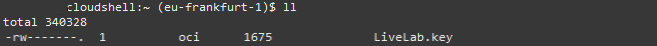
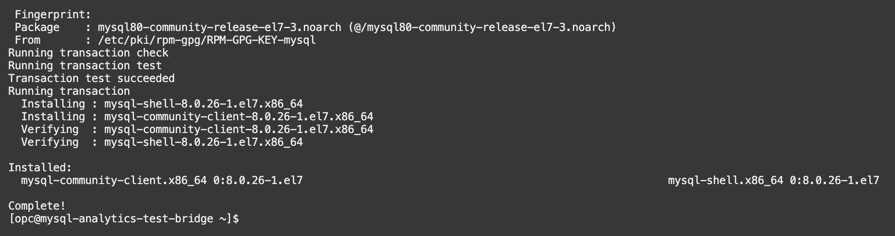
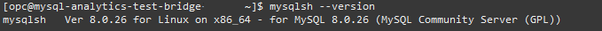
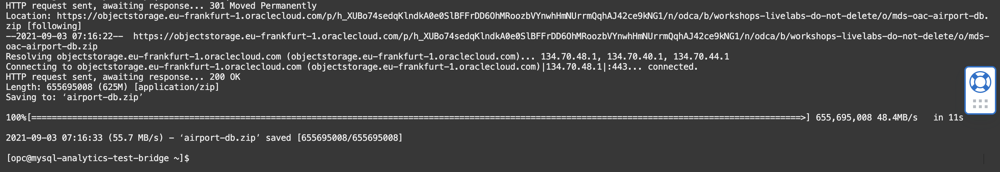
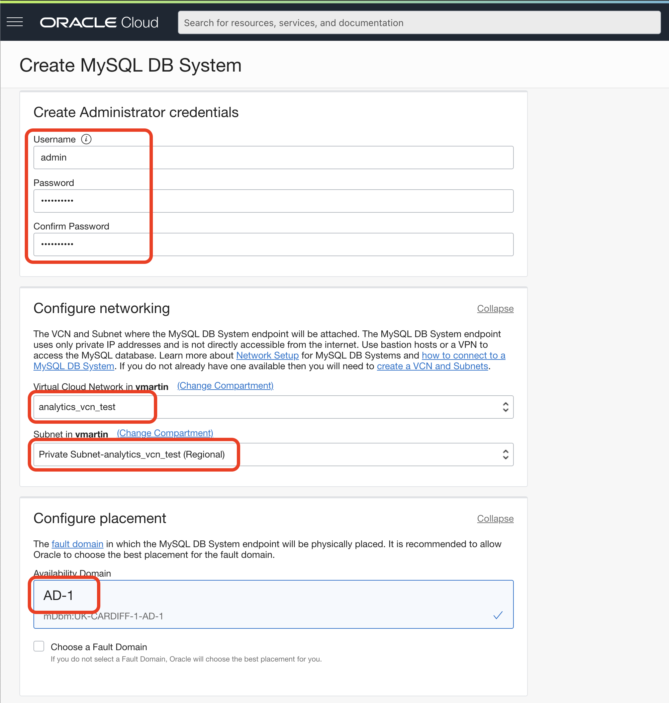
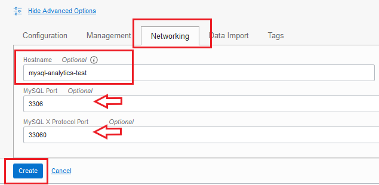

# Infrastructure Configuration 

## Introduction

In this lab we will build the infrastructure that we will use to run the rest of the workshop. The main three elements that we will be creating are a Virtual Cloud Network which helps you define your own data center network topology inside the Oracle Cloud by defining some of the following components (Subnets, Route Tables, Security Lists, Gateways, etc.), bastion host which is a compute instance that serves as the public entry point for accessing a private network from external networks like the internet, and we will create an Oracle Analytics Cloud instance which is embedded with machine learning, that helps organizations to discover unique insights faster with automation and intelligence. Finally, we will create a MySQL DB Service instance that we will allow us to configure a heatwave cluster later. 

Estimated Lab Time: 35 minutes.

### Objectives
 
-	Create a Virtual Cloud Network and allow traffic through MySQL Database Service port
-	Create a Bastion Host compute instance 
-	Connect to the Bastion Host, install MySQL Shell and download the workshop Dataset
- Create an Oracle Analytics Cloud instance
- Create an Instance of MySQL in the Cloud

### Prerequisites

  - Oracle Free Trial Account.


## Task 1: Create a Virtual Cloud Network and allow traffic through MySQL Database Service port

1. Log-in to your OCI tenancy. Once you have logged-in, select **Networking >> Virtual Cloud Networks** from the **menu icon** on the top left corner.

    

2. From the Compartment picker on the bottom left side, select your compartment from the list.

  _Note: If you have not picked a compartment, you can pick the root compartment which was created by default when you created your tenancy (ie when you registered for the trial account). It is possible to create everything in the root compartment, but Oracle recommends that you create sub-compartments to help manage your resources more efficiently._

    

3. To create a virtual cloud network, click on **Start VCN Wizard**.
  
    

4. Select **VCN with Internet Connectivity** and click **Start VCN Wizard**.

    

5. Now you need to complete some information and set the configuration for the VCN. In the **VCN Name** field enter the value 
**`analytics_vcn_test`** (or any name at your convenience), and make sure that the selected compartment is the right one. Leave all the rest as per default, Click **Next**.

    

6. Review the information showed is correct and click **Create**.

    

7. Once the VCN will be created click **View Virtual Cloud Network**.

    

8. Click on the **`Public_Subnet-analytics_vcn_test`**. 

    

9. Earlier we set up the subnet to use the VCN's default security list, that has default rules, which are designed to make it easy to get started with Oracle Cloud Infrastructure. 
 Now we will customize the default security list of the VCN to allow traffic through MySQL Database Service ports by clicking on  **`Default_Security_List_for_analytics_vcn_test`**.

    

10. Click on **Add Ingress Rules**.

    

Insert the details as below:
```  
Source CIDR:  <copy> 0.0.0.0/0 </copy>
```
```  
Destination Port Range: <copy> 3306 </copy>
```
```  
Description:  <copy> MySQL Port </copy>
```
At the end click the blue button _**Add Ingress Rules**_.

  At the end click the blue button **Add Ingress Rules**.

  


## Task 2: Create a bastion host compute instance  

1. From the main menu on the top left corner select **Compute >> Instances**.
  
    

2. In the compartment selector on the bottom left corner, select the same compartment where you created the VCN. Click on the **Create Instance** blue button to create the compute instance.

    

3. In the **Name** field, insert **mysql-analytics-test-bridge** (or any other name at your convenience). This name will be used also as internal FQDN. 
  The **Placement and Hardware section** is the section where you can change Availability Domain, Fault Domain, Image to be used, and Shape of resources. For the scope of this workshop leave everything as default.

    


4. As you scroll down you can see the **Networking** section, check that your previously created **VCN** is selected, and select your PUBLIC subnet **`Public Subnet-analytics_vcn_test(Regional)`** from the dropdown menu.
  
    

### **Task 2.4:** 
- Scroll down and MAKE SURE TO DOWNLOAD the proposed private key. 
You will use it to connect to the compute instance later on.
Once done, click **Create**.

    

6. Once the compute instance will be up and running, you will see the square icon on the left turning green. However, you can proceed to the next **Task** until the provisioning is done.
  
    


## **Task 3:** Connect to the Bastion Host, install MySQL Shell and download the workshop Dataset

1. In order to connect to the bastion host, we will use the cloud shell, a small linux terminal embedded in the OCI interface.
To access cloud shell, click on the shell icon next to the name of the OCI region, on the top right corner of the page.

    


- Once the cloud shell is opened, you will see the command line:
  
    

### **Task 3.2:**
- Drag and drop the previously saved private key into the cloud shell. You can verify the key file name with the following command:
  ```
  <copy>ll</copy>
  ```
  
    

    


### **Task 3.3:**
- Copy the _**Public IP Address**_ of the compute instance you have just created.

    

5. In order to establish an ssh connection with the bastion host using the Public IP, execute the following commands:
    ```
    <copy>
    chmod 600 <private-key-file-name>.key
    </copy>
    ```

    ```
    <copy>
    ssh -i <private-key-file-name>.key opc@<compute_instance_public_ip>
    </copy>
    ```
    

  If prompted to accept the finger print, type **yes** and hit enter, then you will get a Warning.

  _**Warning: Permanently added '130. . . ' (ECDSA) to the list of known hosts.**_

Now that you have connected to the instance you can proceed to the next Task.

### **Task 3.4:**
- From the established ssh connection, install MySQL Shell and MySQL client executing the following commands and the expected outputput should be as following:
  
```
<copy>wget https://dev.mysql.com/get/mysql80-community-release-el7-3.noarch.rpm</copy>
```

```
<copy> sudo yum localinstall -y mysql80-community-release-el7-3.noarch.rpm</copy>
```

```
<copy> sudo yum install -y mysql-shell</copy>  
```

```
<copy> sudo yum install -y mysql-community-client</copy>
```





### **Task 3.5:**

- Check out the MySQL shell version
```
<copy>mysqlsh --version</copy>
```


### **Task 3.6:**
- Download the airportdb sample database that we will use for this workshop using the following commands:
```
<copy>
cd /home/opc
</copy>
```
_Note:_ It takes around 15-20 minutes to finish, you can proceed to the next task until it is done downloading.
```
<copy>wget https://downloads.mysql.com/docs/airport-db.zip</copy>
```




## Task 4: Create an Oracle Analytics Cloud instance

In this task we will create an Oracle Analytics Cloud instance before we proceed to the next lab, since it may takes sometime to be provisioned, so it will be **Running** status when we will use it later in this workshop.

1. Click on the menu icon on the left. Verify that you are signed in as a **Single Sign On** (Federated user) user by selecting the **Profile** icon in the top right hand side of your screen. If your username is shown as:

    oracleidentitycloudservice/<your username>

 Then you are **connected** as a **Single Sign On** user.

    

  If your username is shown as:

    <your username>

 Then you are **signed in** as an **Oracle Cloud Infrastructure** user and you may proceed to the **Task 4.2** .

  If your user does not contain the identity provider (**oracleidentitycloudprovider**), please logout and select to authenticate using **Single Sign On**.

    

  To be capable of using **Oracle Analytics Cloud** we need to be Sign-On as a **Single Sign-On** (SSO) user.

  For more information about federated users, see **[User Provisioning for Federated Users.](https://docs.oracle.com/en-us/iaas/Content/Identity/Tasks/usingscim.htm)**

2. Now going back to main page click the **hamburger menu** in the upper left corner and click on **Analytics & AI -> Analytics Cloud**.

    


3. Click **Create instance** and in the new window, fill out the fields as shown in the image below. Make sure to select 2 OCPUs, the Enterprise version and the **License Included** button. Finally click **Create** to start the provisioning of the instance.

    

    - Name: **OACDemo**
    - OCPU: **2**
    - License Type: **License Included**
  
_**Note:**_ It takes about _**15-20 minutes**_ to create the OAC instance you can proceed to the next task until it is done.

    

## **Task 5:** Create MySQL Database

### **Task 5.1:**
- From the console main menu on the left side select _**Databases >> DB Systems**_
  


### **Task 5.2:**
- It will bring you to the DB System creation page. 
Look at the compartment selector on the left and check that you are using the same compartment used to create the VCN and the Compute Instance. Once done, click on _**Create MySQL DB System**_.


### **Task 5.3:**
- Start creating the DB System. Cross check again the compartment and assign to the DB System the name:
```
<copy> mysql-analytics-test</copy>
```
 Select the HeatWave box, this will allow to create a MySQL DB System which will be HeatWave-ready. 
  


### **Task 5.4:**
- In the _**Create Administrator Credential**_ section enter the following information:
  
```
username: <copy>admin</copy>
```
```
password: <copy>Oracle.123</copy>
```
- In the _**Configure Networking**_ section make sure you select the same VCN and subnet which you have used to create the Compute Instance _**`Public-Subnet-analytics_vcn_test(Regional)`**_.

- Leave the default availability domain and proceed to the _**Configure Hardware**_ section.
 
  

### **Task 5.5:**
- Confirm that in the _**Configure Hardware**_ section, the selected shape is **MySQL.HeatWave.VM.Standard.E3**, CPU Core Count: **16**, Memory Size: **512 GB**, Data Storage Size: **1024**.
In the _**Configure Backup**_ section leave the default backup window of **7** days.


### **Task 5.6:**
- To select a Configuration, scroll down and click on _**Show Advanced Options**_. 
  


- In the Configuration tab click on _**Select Configuration**_. 


### **Task 5.7:**
- In the _**Browse All Configurations**_ window, select **MySQL.HeatWave.VM.Standard.E3.Standalone**, and click the button _**Select a Configuration**_. 


- If everything is correct you should see something corresponding to the below:


### **Task 5.8:**
- Go to the Networking tab, in the Hostname field enter (same as DB System Name):
```
<copy> mysql-analytics-test</copy> 
```
Check that port configuration corresponds to the following:


MySQL Port: **3306**

MySQL X Protocol Port: **33060**

 

Once done, click the _**Create**_ button.




- The MySQL DB System will have _**CREATING**_ state (as per picture below). 
  


As a recap we have created a VCN and added an additional Ingress rules to the Security list, and created a compute instance that serves as a bastion host and launched the cloud shell to import the private keys to connect to the compute instance, we also installed MySQL Shell and MySQL client, and downloaded the dataset that will be used later on for benchmark analysis.
Also, we created an Oracle Analytics Cloud instance which we will eventually use later in this workshop. Finally, created MySQL Database instance which will be used to enable the HeatWave service later.

Well done, you can now proceed to the next lab!

 

## Acknowledgements
- **Author** - Rawan Aboukoura - Technology Product Strategy Manager, Vittorio Cioe - MySQL Solution Engineer
- **Contributors** - Priscila Iruela - Technology Product Strategy Director, Victor Martin - Technology Product Strategy Manager 
- **Last Updated By/Date** - Kamryn Vinson, August 2021
