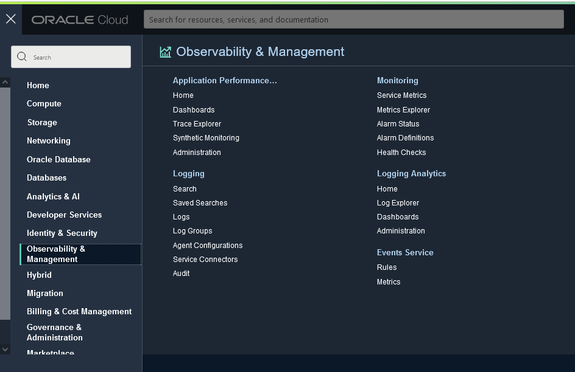
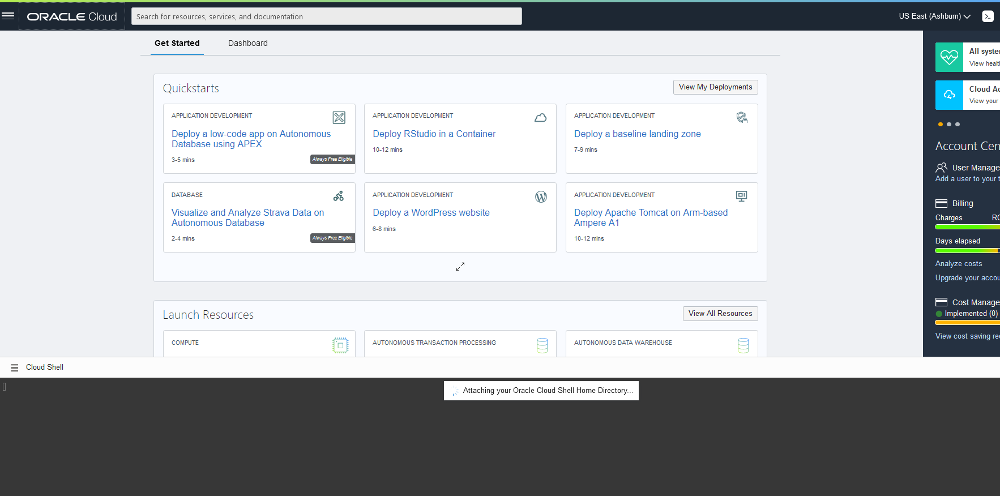
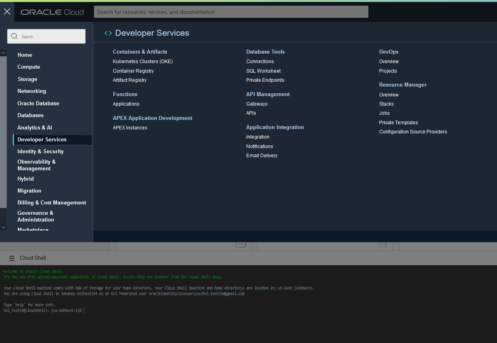
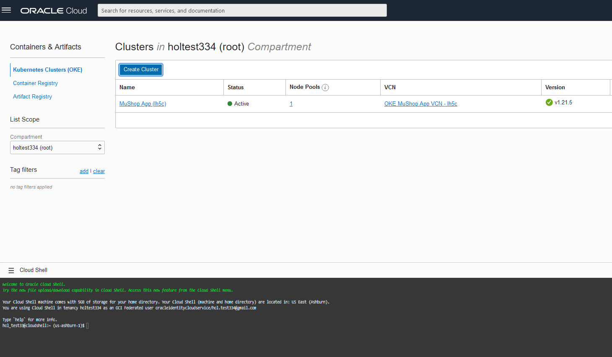
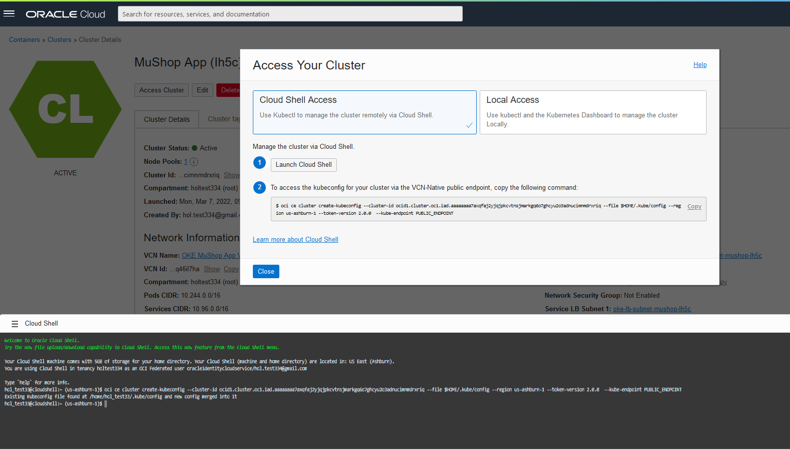
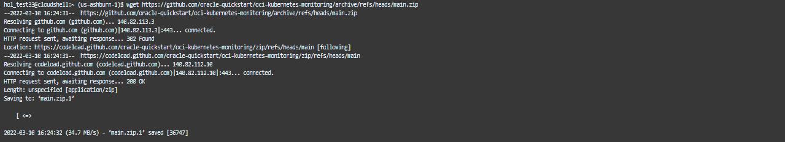

# Infrastructure Configuration

## Introduction

In this lab we will build the infrastructure that we will use to run the rest of the workshop. MuShop is a showcase of several Oracle Cloud Infrastructure services in a unified reference application. The sample application implements an e-commerce platform built as a set of micro-services. The accompanying content can be used to get started with cloud native application development on Oracle Cloud Infrastructure.
Terraform configuration that deploys the MuShop basic sample application on Oracle Cloud Infrastructure and is designed to run using only the Always Free tier resources.

The repository contains the application code as well as the Terraform code to create a Resource Manager stack, that creates all the required resources and configures the application on the created resources. To simplify getting started, the Resource Manager Stack is created as part of each release

Estimated Time: X minutes

### Objectives

In this lab, you will:
-	Deploy the Oracle Cloud Infrastructure Container Engine for Kubernetes(OKE).


### Prerequisites

- Log-in to your OCI tenancy.
  

## Task 1: Deploy the Oracle Cloud Infrastructure Container Engine for Kubernetes(OKE)

This guide shows how to use the Resource Manager to provision the prerequisites for the Observability and management. This includes the configuration..... 
This process is automated. However, if you prefer a manual approach, to control all the aspects of the provisioning, you can find those instructions here **[MuShop](https://apexapps.oracle.com/pls/apex/dbpm/r/livelabs/workshop-attendee-2?p210_workshop_id=793&p210_type=1&session=15724263023547)**: Build and Deploy the MuShop App. In all other cases, please continue with the steps below for automated provisioning.

1. Press this button below to open the Resource Manager.
	<p>
	<a
	href="https://cloud.oracle.com/resourcemanager/stacks/create?zipUrl=https://github.com/RawanAk/terraformDB/releases/download/v0.2-alpha/terraformfilesDemo1.zip" target="_blank">
	
	</a>
	
	</p>

     You may have to log in first in case you were not logged into to Oracle Cloud Infrastructure already.

2.  Configure the Stack.

    - Check "I have reviewed and accepted the Oracle Terms of Use".

    - Select the right compartment. If you have just created your Oracle cloud account you may choose the root compartment.

    - Click Next.
     
    
    
3. Make sure that that the "Run Apply" option is checked, then Click "Create".

	

4. Provisioning should take about x minutes after which the status of the Job should become "Succeeded".
   
   	

## Task 2: Enale Logging Analytics

 - Logging Analytics Service must be enabled in the given OCI region before trying out the following Solution. Refer **[Logging Analytics Quick Start](https://docs.oracle.com/en-us/iaas/logging-analytics/doc/quick-start.html)** for details.  
 - from the the hamburger menu select "Observability & Managemnet" >> "Logging Analytics" 
  

## Task 3: connect to cloud shell and access OKE cluster 

1. click on the cloud shell button
 

2. select the OKE
 

3. select the MuShop App cluster
 
  
4. click Access Cluster >> copy, and then paste it in the cloud shell
 

5. run the following command to download fluentd
```
   <copy> wget https://github.com/oracle-quickstart/oci-kubernetes-monitoring/archive/refs/heads/main.zip </copy>
```

6. unzip the downloaded folder
   
```
<copy> unzip main.zip </copy>
```
and change the directory as the following:

```
<copy>
cd 

  Well done, you can now proceed to the next lab!

## Acknowledgements
  - **Author** - Rawan Aboukoura - Technology Product Strategy Manager, Vittorio Cioe - MySQL Solution Engineer
  - **Contributors** - Priscila Iruela - Technology Product Strategy Director, Victor Martin - Technology Product Strategy Manager 
  - **Last Updated By/Date** - Anoosha Pilli, September 2021
